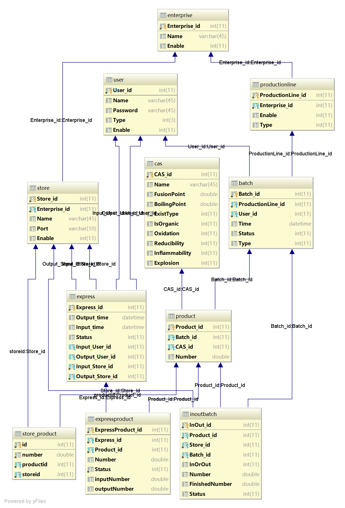
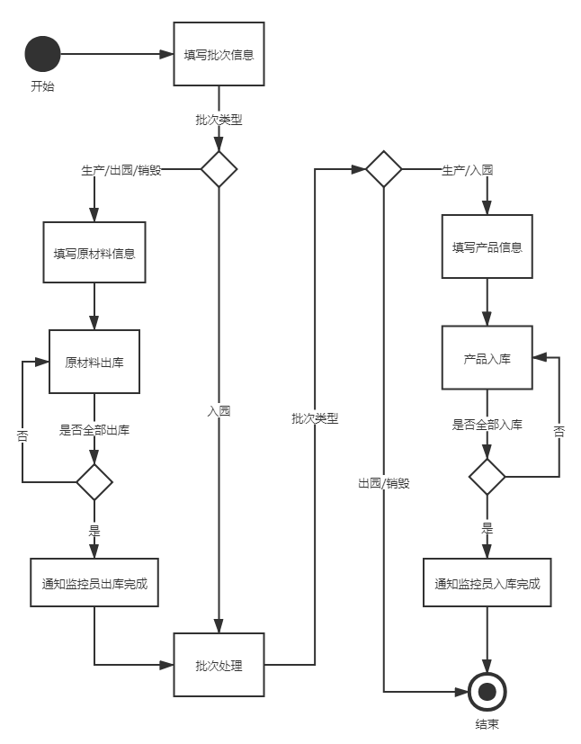
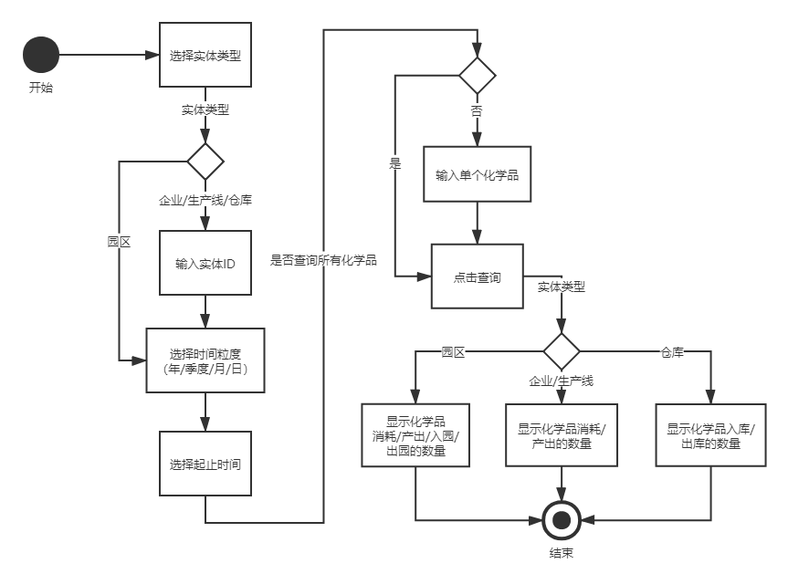

# 开发文档

云端服务器：49.234.54.34，后端端口8088，前端端口3000

## 1 后端项目

项目地址：https://github.com/yuhaoxiao/Chemical_Monitor_System

### 1.1 项目结构

* **config**：配置各种中间件，采用springboot自动配置类功能自动产生相应实例

* **constant**：所有项目中的常量和枚举定义

* **controller**：相应前端请求的控制器

* **dao**：数据查询模块

* **service**：业务逻辑模块

* **entity**：数据库层映射实体

* **exception**：自定义异常，用统一的controller捕捉，好处是可以在自定义的controller统一捕获，人为设定异常返回逻辑

* **request**：请求体统一封装

* **response**：返回体统一封装，方便获得相应的状态码

* **utils**：各种系统需要用到的工具类，封装了各种中间件接口以及常用功能

* **vo**：表现层对象

### 1.2 技术介绍

* **Redis**：主要用于重写shiro的缓存接口以及实现shrio中token的过期用户登录功能

* **Kafka和websocket**：实现各种消息的推送。比如当物流单已完成时需要对管理员/监控员进行推送消息，我们需要先将消息发送到kafka消息队列（物流单状态更新涉及的数据库操作和将消息发送给管理员其实是两个任务，通过消息队列能够解耦，由于并发量不大，后期可以替换成本地异步任务就好，只是因为当时在学kafka随手拿过来玩一下），之后kafka消费者接收到请求，需要调用websocket封装好的消息发送接口向前端发送消息。（这里要注意，当管理员没有上线的时候，websocket是没有建立前后端的连接的，需要暂停kafka消费者对broker中消息的消费，因此应当关闭kafka消费者，让消息存在kafka队列中，这里看相应代码就能明白）

* **k-means**：聚类算法主要用于安全模块，主要是规划两个功能，后期可以去掉或者改进：1.化学品是否能够入库。这里是计算入库化学品到所有仓库质心的最大距离和最小距离的平均值k1，以及入库化学品到目标仓库的距离k2，如果k1小于k2则说明目标化学品到和目标仓库里面所有化学品的性质差距过大。2.化学品入库之后的存放位置。这里直接和所有仓库的化学品进行聚类算法就行（补充几个背景：1.化学品性质差别过大容易发生反应，判定为不安全2.将每个仓库看成一个簇，化学品看成簇中的节点，每个化学品有各种性质可以看成节点的向量，进而可以计算出化学品之间的距离以及每个簇的质心）

* **Shiro**：用了token的方式验证，涉及到用户过期重发token的情况比较复杂，通读代码

* **Hiberinate**：后期如果有业务逻辑的变动最好详细设计一下项目中需要的级联关系，避免多次访问数据库产生的I/O开销

### 1.3 项目部署

idea上方build选项中build整个项目，在out文件夹中找到相应的jar包丢到服务器上然后后台启动就好（云服务器上jar的路径目前在/root路径下，更新项目只需要替换相应路径的jar就行）。具体参考https://www.cnblogs.com/stm32stm32/p/9973325.html。

本地启动需要安装redis、zookeeper和kafka等中间件，安装过程百度。

云服务器启动：/root路径下启动begin.sh脚本（启动zookeeper和kafka），redis需要切换到redis用户下启动（root用户启动redis可能会遭到攻击），redis安装路径为/usr/local/redis，所有中间件启动完成后在/root路径下启动找到项目的jar包后台启动。

所有云服务器上的中间件服务的账号密码在项目中的yml文件里已经写好。

### 1.4 其他问题

*  历史信息查询模块涉及到业务和深度优先，相对来说比较复杂，后期如果遇到更改可以和秦岭讨论

* 原先设计需要在运输过程中进行加密解密，相关的加密算法在utils包中对的encryption包已经实现好，包括对称加密和非对称加密，后期需要根据rfid支持的位数来决定使用哪种算法，因为加密之后可能过长，rfid标签容不下

* Rfid设备因为疫情没有接入，系统中出现一些仿造rfid读写流程的测试代码，到时候可以自行删除和修改

* 后期如果数据量大建议引入ElasticSearch查询引擎

  

## 2 前端项目

项目地址：https://github.com/ql437967081/Chemical_Monitor_System_Frontend

### 2.1 项目结构

* **components**：页面顶部、底部，导航栏

* **config**：配置文件，包含各角色导航菜单内容、请求后端HTTP地址等

* **request.js**：http请求方法封装（token）

* **router.js、AuthRouter**：路由

* **pages/home**：各角色主页

* **pages/user**：各角色页面框架

* **pages/ui**：各角色的各个详细页面

### 2.2 主要技术

* **react**：本项目使用react框架

* **antd**：项目的UI 组件库使用ant design 3.x，文档参考https://3x.ant.design/docs/react/getting-started-cn

* **axios**：http请求，已封装在request.js中

### 2.3 项目部署

包管理器使用yarn，本地启动直接start。

云端部署步骤，参考https://segmentfault.com/a/1190000011085024  build后项目中会多出一个build的文件夹，把build文件夹中的内容放到云服务器上/var/lib/nginx/chemical中，并将这些文件的所有者更改为nginx，即可完成更新；本项目在nginx中的配置文件是/etc/nginx/conf.d/example.conf。

### 2.4 其他问题

* 优化导航布局以及页面布局，并可根据功能进行流程合并

* 优化系统的消息提醒功能

## 3 系统分析与设计

### 3.1 用例

**管理实体信息：**

管理员对园区内实体如企业、生产线、仓库、用户等信息进行增加、删除、修改、查询。

**查看产品历史信息：**

监控员对园区内一个批次的所有产品进行整个生命周期的查询，显示所有原料的历史来源和所有产品的后续用途。

**查看吞吐量信息：**

监控员对园区内某一维度（园区、企业、生产线、仓库）的各化学品吞吐量（生产、消耗、出库、入库等）在某一时间维度（年、季度、月、日）范围内进行统计查询。

**接收流程信息：**

监控员对园区内操作员在系统内进行的所有操作流程进行实时流程信息的监控。

**记录产品入园、出园、销毁：**

操作员录入入园的化学品和数量信息，系统创建入园批次，产品编号，入库信息；操作员选择某一仓库的某一批次的产品并录入数量，选择出园（销毁），系统创建出园批次（销毁批次）、出库信息。

**记录产品生产：**

操作员发起一次生产流程，选择某仓库某批次的产品并录入数量，作为该生产批次的原料，系统创建生产批次、出库信息；生产完成后，操作员录入产出的产品及数量，系统创建产品编号、入库信息。

**记录生产（入园、出园、销毁）出库、入库：**

出库：操作员输入生产（出园、销毁）批次，选择需要出库原料（出园、销毁）的仓库，用rfid读写器扫描出库产品的rfid标签，系统读取后显示读取到的产品及数量，直到完成该批次所有出库。

入库：操作员输入生产（入园）批次，选择需要入库产品的仓库，填写产品编号和数量，贴上rfid标签并用rfid读写器扫描，系统将产品信息写入rfid标签并显示这次扫描的标签的产品及数量，直到完成该批次所有入库。

**记录产品物流：**

操作员发起一次物流流程，选择出库仓库和入库仓库，系统显示出库仓库的所有产品信息，操作员选择需要运输的产品及数量，发起这次物流，系统创建物流单、出库、入库信息。

**记录物流出库、入库：**

操作员输入物流单号，用rfid读写器扫描出库（入库）产品的rfid标签，系统读取后显示读取到的产品及数量，直到完成该物流所有出库（入库）。

**取消物流：**

操作员输入物流单号，取消这次物流流程，系统对于未开始的物流直接取消，对于已经开始的物流自动创建一个反向物流单及相应出库、入库信息。

### 3.2 数据库

数据库表的设计如下：

* batch表

| **名称** | **列名**          | **数据类型** | **注释**                                                     |
| -------- | ----------------- | ------------ | ------------------------------------------------------------ |
| 批次ID   | Batch_id          | int(11)      | 主键                                                         |
| 生产线ID | ProductionLine_id | int(11)      | 外键                                                         |
| 创建者ID | User_id           | int(11)      | 外键                                                         |
| 创建时间 | Time              | datetime     |                                                              |
| 批次状态 | Status            | int(11)      | 0：未开始  1：原材料上线  2：生产中  3：产品下线  4：已完成  5：出错 |
| 批次类型 | Type              | int(11)      | 0：生产  1：入园  2：出园  3：销毁                           |

* cas表

| **名称**      | **列名**       | **数据类型** | **注释**                  |
| ------------- | -------------- | ------------ | ------------------------- |
| 化学品Cas号   | CAS_id         | int(11)      | 主键                      |
| 化学品名称    | Name           | varchar(45)  |                           |
| 熔点          | FusionPoint    | double       |                           |
| 沸点          | BoilingPoint   | double       |                           |
| 存在形式      | ExistType      | int(11)      | 0：固体  1：液体  2：气体 |
| 有机物/无机物 | IsOrganic      | int(11)      | 0：有机物  1：无机物      |
| 氧化性        | Oxidation      | int(11)      |                           |
| 还原性        | Reducibility   | int(11)      |                           |
| 易燃性        | Inflammability | int(11)      |                           |
| 易爆性        | Explosion      | int(11)      |                           |

* enterprise表

| **名称** | **列名**      | **数据类型** | **注释** |
| -------- | ------------- | ------------ | -------- |
| 企业代号 | Enterprise_id | int(11)      | 主键     |
| 企业名称 | Name          | varchar(45)  |          |
| 是否可用 | Enable        | int(11)      |          |

* express表

| **名称**     | **列名**        | **数据类型** | **注释**                                                     |
| ------------ | --------------- | ------------ | ------------------------------------------------------------ |
| 物流单号     | Express_id      | int(11)      | 主键                                                         |
| 出库时间     | Output_time     | datetime     |                                                              |
| 入库时间     | Input_time      | datetime     |                                                              |
| 物流单状态   | Status          | int(11)      | 0：未开始  4：出库中  1：已出库  5：入库中  2：已入库  3：出错 |
| 入库操作员ID | Input_User_id   | int(11)      | 外键                                                         |
| 出库操作员ID | Output_User_id  | int(11)      | 外键                                                         |
| 入库仓库ID   | Input_Store_id  | int(11)      | 外键                                                         |
| 出库仓库ID   | Output_Store_id | int(11)      | 外键                                                         |

* expressproduct表

| **名称** | **列名**          | **数据类型** | **注释**    |
| -------- | ----------------- | ------------ | ----------- |
| ID       | ExpressProduct_id | int(11)      | 主键        |
| 物流单号 | Express_id        | int(11)      | 外键        |
| 产品编号 | Product_id        | int(11)      | 外键        |
| 数量     | Number            | double       |             |
| 状态     | Status            | int(11)      | 同express表 |
| 入库数量 | inputNumber       | double       |             |
| 出库数量 | outputNumber      | double       |             |

* inoutbatch表

| **名称**   | **列名**       | **数据类型** | **注释**                                 |
| ---------- | -------------- | ------------ | ---------------------------------------- |
| ID         | InOut_id       | int(11)      | 主键                                     |
| 产品编号   | Product_id     | int(11)      | 外键                                     |
| 仓库ID     | Store_id       | int(11)      | 外键                                     |
| 批次ID     | Batch_id       | int(11)      | 外键                                     |
| 原料/产品  | InOrOut        | int(11)      | 0：in batch  1：out batch                |
| 应完成数量 | Number         | double       |                                          |
| 已完成数量 | FinishedNumber | double       |                                          |
| 状态       | Status         | int(11)      | 0：未开始  1：进行中  2：已完成  3：出错 |

* product表

| **名称**    | **列名**   | **数据类型** | **注释** |
| ----------- | ---------- | ------------ | -------- |
| 产品编号    | Product_id | int(11)      | 主键     |
| 批次ID      | Batch_id   | int(11)      | 外键     |
| 化学品CAS号 | CAS_id     | int(11)      | 外键     |
| 数量        | Number     | double       |          |

* productionline表

| **名称**     | **列名**          | **数据类型** | **注释**  |
| ------------ | ----------------- | ------------ | --------- |
| 生产线ID     | ProductionLine_id | int(11)      | 主键      |
| 所属企业代号 | Enterprise_id     | int(11)      | 外键      |
| 是否可用     | Enable            | int(11)      |           |
| 类型         | Type              | int(11)      | 同batch表 |

* store表

| **名称**     | **列名**      | **数据类型** | **注释** |
| ------------ | ------------- | ------------ | -------- |
| 仓库ID       | Store_id      | int(11)      | 主键     |
| 所属企业代号 | Enterprise_id | int(11)      | 外键     |
| 仓库名称     | Name          | varchar(45)  |          |
| Rfid端口     | Port          | varchar(10)  |          |
| 是否可用     | Enable        | int(11)      |          |

* store_product表

| **名称** | **列名**  | **数据类型** | **注释** |
| -------- | --------- | ------------ | -------- |
| ID       | id        | int(11)      | 主键     |
| 数量     | number    | double       |          |
| 产品编号 | productid | int(11)      | 外键     |
| 仓库ID   | storied   | int(11)      | 外键     |

* user表

| **名称** | **列名** | **数据类型** | **注释**                        |
| -------- | -------- | ------------ | ------------------------------- |
| ID       | User_id  | int(11)      | 主键                            |
| 用户名   | Name     | varchar(45)  |                                 |
| 密码     | Password | varchar(45)  |                                 |
| 用户类型 | Type     | int(3)       | 1：管理员  2：监控员  3：操作员 |
| 是否可用 | Enable   | int(11)      |                                 |

### 3.3 重要模块详细设计

#### 3.3.1 批次模块

批次模块是本系统的主要模块，是危险化学品生命周期管理系统在园区内使用的主要业务，包括了生产、入园、出园、销毁等园区主要工作的流程。批次分为生产批次、入园批次、出园批次、销毁批次。以生产批次为例，一个生产批次代表了一次生产线作业的化学反应，有若干原材料投入该批次生产，然后产出了若干产品。整个生产批次的流程有：填写批次信息（哪条生产线）、填写原材料信息、原材料出库、批次处理（生产中）、填写产品信息、产品入库。其中原材料出库和产品入库两个步骤需要涉及到RFID标签的读写，读写的内容主要为产品的编号、数量等。
	
将入园、出园、销毁同生产统一起来，共同作为批次模块的设计，增强了系统的可复用性、可修改性。入园的产品作为入园批次的产出，所以入园批次没有原材料；出园/销毁的产品作为出园/销毁批次的原材料，所以出园/销毁批次没有产品。批次模块的流程如下图所示：

#### 3.3.2 物流模块

#### 3.3.3 RFID读写模块

#### 3.3.4 历史信息查询模块

#### 3.3.5 吞吐量统计模块

吞吐量统计模块是提供给监控员查询园区内危险化学品在一定时间范围内吞吐量的功能模块。监控员先选择需要查询的实体类型（园区、企业、生产线或仓库），输入实体的ID，再选择时间粒度（年、季度、月、日），输入起止时间，就可以统计在此实体范围内和时间范围内的所有化学品的吞吐量数据了。如果只需要查询某一单一化学品，也可以再输入化学品进行查询。
	
将园区、企业、生产线、仓库统一起来，监控员可以自行选择查询条件，而系统使用同一接口，增强了系统的可修改性和可扩展性，以后如果增加查询条件范围，可以更方便地进行扩展。对于园区来说，系统关注整个园区在给定时间范围内的消耗、产出、入园、出园的产品数量；对于企业和生产线来说，系统只关注消耗和产出的产品数量；对于仓库来说，系统只关注入库和出库的产品数量。消耗的产品包含了作为原材料投入生产使用的产品，以及销毁的产品；入库和出库既包含了生产出入库，也包含物流出入库。吞吐量统计的流程如下图所示：

